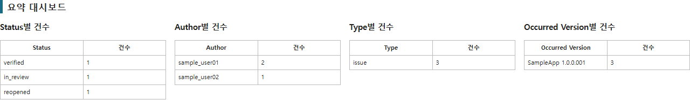
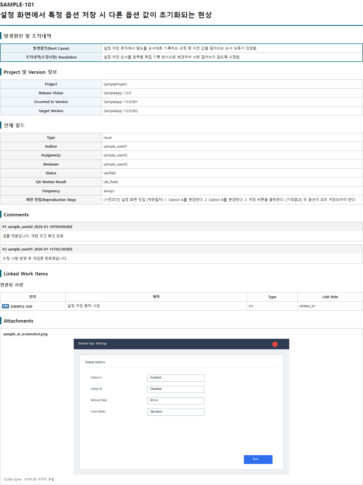

# AI 분석을 위한 ALM 이슈 HTML/Markdown Export 자동화

Polarion(ALM)의 검색 조건에 해당하는 Work Item을 REST API로 수집하고, 본문·댓글·연관
사양/이슈·첨부 이미지를 포함한 **사람이 보기 좋은 HTML**과 **GPT 등 LLM에 붙여넣기 좋은
경량 Markdown**으로 동시에 변환하는 자동화 스크립트입니다.

ALM 자체는 이슈를 잘 저장하지만, 그 데이터를 외부 도구나 AI가 바로 분석하기 좋은 형태로
내보내 주지는 않습니다. 이 스크립트는 그 사이에 있는 "데이터 전처리 계층" 역할을 합니다.

```
ALM 원본 데이터  →  Python 자동화 (검색·정리·이미지 복원)  →  HTML / Markdown  →  GPT 분석
```

## 스크린샷

> 아래 화면은 전부 가상의 샘플 데이터로 생성한 예시입니다 (`examples/sample_output`).
> 실제 실행 결과는 사내 Polarion 데이터를 그대로 반영합니다.

**요약 대시보드** — Status/Author/Type/Occurred Version별 건수를 한눈에 확인합니다.



**목차(TOC)** — 검색 결과가 많을 때 원하는 이슈로 바로 이동합니다.


**이슈 상세** — 발생원인/조치내역을 최상단에 배치하고, 본문 첨부 이미지를 HTML에 직접
임베드합니다.



## 왜 만들었나

ALM 안에서는 이슈를 잘 볼 수 있지만, 밖에서 활용하기는 어려웠습니다.

- 원하는 검색 결과 전체를 유연하게 내보내기 어려움
- 상세 본문, 댓글, 링크, 첨부 이미지가 일관되게 포함되지 않음
- 발생원인/조치내역이 다른 필드들 사이에 섞여 있어 핵심 파악이 느림
- ALM 내부 이미지 참조(`workitemimg:`)가 로컬 HTML에서 깨짐
- 연결된 항목이 사양인지 이슈인지 번호만으로는 구분이 안 됨
- 검색 결과가 수십 건이면 이슈마다 열기 → 복사 → 정리를 반복해야 함

이 자동화는 검색 Query 하나로 이 과정 전체를 대체하고, 결과를 바로 GPT 분석 자료로 쓸 수
있는 형태로 만드는 것을 목표로 합니다.

## 주요 기능

- **검색 Query 기반 일괄 Export**: 개별 이슈 ID가 아니라 Polarion 검색 Query(Convert to
  Text 결과)를 설정 파일에 넣으면, 조건에 맞는 Work Item 전체를 한 번에 처리합니다.
- **발생원인·조치내역 우선 배치**: `occurrenceCause`/`actionDetails` 등 분석에 중요한
  필드를 문서 최상단에 배치합니다.
- **연관 사양/이슈 자동 구분**: 연결된 Work Item을 다시 조회해 `type` 값 기준으로 사양(SRS)과
  이슈를 구분해서 표시합니다.
- **본문 첨부 이미지 복원**: `workitemimg:` 내부 참조를 첨부파일 API와 매칭해 Base64로
  HTML에 직접 삽입합니다. 재현 절차에 포함된 캡처 이미지도 그대로 보입니다.
- **실패 단위 분리**: 첨부파일 하나가 실패해도 해당 Work Item, 나아가 전체 Export가 중단되지
  않습니다. 실패 내역은 `manifest.json`에 별도로 남습니다.
- **요약 대시보드**: Status/Author/Type/Occurred Version별 건수를 문서 상단에 자동
  집계합니다.
- **목차(TOC) 내비게이션**: 결과가 많을 때 이슈 ID/제목/Status로 원하는 항목으로 바로 이동할
  수 있는 링크를 생성합니다.
- **AI 분석용 경량 Markdown 동시 생성**: HTML은 이미지를 Base64로 품고 있어 파일 용량이
  크고, 텍스트 그대로 GPT 대화창에 붙여넣기엔 토큰 낭비가 큽니다. 같은 내용을 담은 `.md`
  파일을 함께 생성해서, 텍스트 분석이 목적일 때 더 가볍게 사용할 수 있습니다.
- **이슈별 개별 HTML 분리 저장**: 전체 결과가 아니라 이슈 1건만 GPT에 첨부하고 싶을 때를
  위해, 각 `[이슈ID]/report.html`도 함께 생성합니다.

## 설치

```powershell
python -m pip install -r requirements.txt
```

## PAT(Personal Access Token) 설정

```powershell
# 현재 PowerShell 창에서만
$env:POLARION_TOKEN="발급받은 PAT"

# 영구 설정 (새 PowerShell 창부터 적용)
setx POLARION_TOKEN "발급받은 PAT"
```

## 설정

`config.example.yaml`을 복사해 `config.yaml`로 저장한 뒤 사내 환경에 맞게 값을 채우세요.
`config.yaml`은 사내 서버 주소·프로젝트 ID·검색 조건이 들어가므로 `.gitignore`에 포함되어
있고 저장소에는 올라가지 않습니다.

```powershell
copy config.example.yaml config.yaml
```

검색 조건은 Polarion Work Items 화면에서 만든 뒤, Query Pane의 `Convert to Text` 결과를
`config.yaml > search.query`에 그대로 붙여넣으세요. 표시명과 내부 사용자 ID가 다를 수
있으므로, 화면을 보고 직접 추측한 쿼리보다 이 방법이 안전합니다.

## 실행

```powershell
python polarion_query_backup.py --config config.yaml
```

### 첫 시험

`config.yaml`에서 아래처럼 제한한 뒤 먼저 실행해서 필드 매핑을 확인하는 것을 권장합니다.

```yaml
search:
  max_items: 1
```

생성된 `field_inventory.json`과 각 이슈의 `backup.json`에서 실제 커스텀 필드 ID를 확인한
후 `fields.display`의 key를 사내 환경에 맞게 조정하세요.

## 출력 구조

```
polarion_backup/
├─ polarion_query_backup.html   # 사람이 보는 통합 문서 (요약 대시보드 + 목차 + 이슈 전체)
├─ polarion_query_backup.md     # GPT 등에 붙여넣기 좋은 경량 Markdown
├─ field_inventory.json         # 조회된 필드 ID 목록
├─ manifest.json                # 처리 건수 / 실패 내역
└─ [이슈ID]/
   ├─ backup.json               # API 원본 데이터
   ├─ report.html               # 이 이슈 1건만 담은 개별 HTML
   └─ attachments/              # 첨부파일 (이미지 포함)
```

## GPT 등 AI 분석에 활용할 때

- **HTML**을 첨부하면 이미지까지 포함해서 사람이 검토하듯 볼 수 있습니다. 재현 절차에 캡처
  이미지가 있는 이슈는 HTML(또는 이슈 폴더 전체)을 첨부하세요.
- **Markdown**은 텍스트 위주 분석(발생원인 분류, 공통 원인 요약, 리포트 초안 작성 등)에
  더 적합합니다. 다만 Markdown 안의 이미지 링크는 로컬 파일 상대경로이기 때문에, GPT
  대화창에 **텍스트만 붙여넣으면 이미지가 보이지 않습니다.** 이미지까지 함께 봐야 하는
  분석이라면 Markdown 대신 HTML을 첨부하거나, 이슈 폴더(HTML + attachments)를 통째로
  첨부하세요.

```
첨부한 HTML은 [버전]에서 발생한 미완료 이슈 자료입니다.
다음 기준으로 분석해줘.
1. 발생원인별 이슈 분류
2. 반복적으로 나타나는 원인
3. 사양 보완이 필요한 이슈
4. 테스트케이스 보강이 필요한 영역
5. 우선 확인해야 할 이슈
```

## 예시 결과물

`examples/sample_output/`에 가상의 샘플 데이터로 생성한 결과물이 들어 있습니다. 실제
Polarion 접속 없이 출력 형식을 먼저 확인하고 싶을 때 열어보세요.

## 핵심 설계 원칙

- 검색 조건은 코드가 아닌 설정 파일에서 관리한다 (특정 이슈 ID에 종속되지 않음)
- 개별 첨부파일 실패가 전체 Export를 중단시키지 않는다
- AI 분석에 불필요한 필드는 출력 단계에서 제외한다
- 원본 JSON과 사람이 읽는 HTML/Markdown을 함께 보관한다
- ALM 고유 이미지 참조를 독립적인 이미지로 변환한다
- 연결 항목의 Type을 다시 조회해 사양과 이슈를 구분한다

## 버전 히스토리

- **v4**: 동영상 첨부 미다운로드 처리, 첨부파일 실패 격리, Edge PDF 한글 경로 우회
- **v5**: 연결 Work Item 상세 조회로 사양/이슈 구분, 본문 이미지 Base64 임베드
- **v6 (현재)**: PDF 생성 기능 제거(미사용 코드 정리), AI 분석용 경량 Markdown 동시 출력,
  요약 대시보드, 목차(TOC) 내비게이션, 이슈별 개별 HTML 분리 저장, Author/Assignee/Reviewer
  relationship 필드 정상 표시
