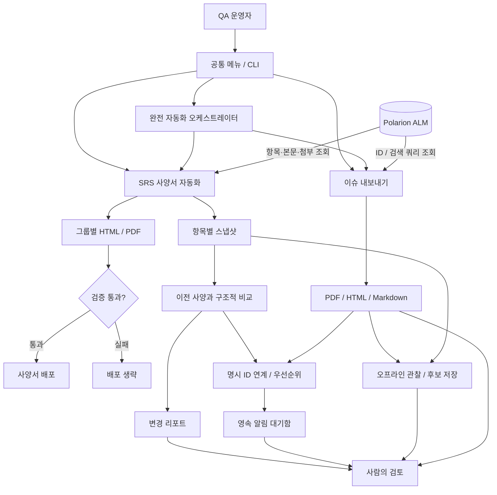

# ALM-QA-Automation

### 사양 변경과 이슈를, 검토할 수 있는 문서로

**Polarion ALM의 SRS 사양서와 이슈를 수집하고, 변경 근거와 PDF·HTML·Markdown 산출물로 연결하는 QA 업무 자동화 도구입니다.** 하나의 Windows 프로그램이 개별 실행과 평일 통합 실행을 함께 제공하며, 완전한 수집 결과만 분석·알림 기준으로 확정합니다.

**AI 코딩 에이전트를 활용한 요구사항 설계 · 구현 · 독립 리뷰 · 검증 중심 개발**

`Python` · `Polarion REST API` · `Playwright / Chromium` · `pytest` · `Windows Task Scheduler`

[기준 사양](SPEC.md) · [검증 근거](docs/RELIABILITY_VALIDATION.md) · [개선 방향](docs/AUTOMATION_ROADMAP.md) · [변경 이력](CHANGELOG.md)

## 해결하는 문제

사양서와 이슈를 수동으로 내려받으면 자료를 모으는 일과 변경 내용을 판단하는 일이 뒤섞입니다. 이 프로젝트는 **수집·문서화·변경 비교를 반복 가능한 작업으로 만들고, 검토자가 원문과 변경 근거를 확인할 수 있게 하는 것**에 초점을 둡니다.

| QA 작업 | 프로그램이 제공하는 결과 |
|---|---|
| 최신 사양서를 문서로 정리 | SRS별 스냅샷, 그룹별 HTML/PDF, 검증 후 배포 |
| 이전 사양과 달라진 부분 확인 | 신규·삭제·변경 항목과 변경 전후를 담은 리포트 |
| 특정 이슈를 검토·공유 | ID 또는 검색 쿼리 기반 PDF/HTML/Markdown, 댓글·첨부·연결 항목 |
| 저장 결과에서 검토할 변경 찾기 | 관찰 모드의 변경 전후 근거, 중복 없는 후보와 검토 상태 |
| 같은 작업을 다시 수행 | 공통 메뉴와 CLI, SRS 예약 실행 및 중복 실행 방지 |
| 매일 검토 대상을 놓치지 않기 | 평일 09:00 통합 수집, 명시 링크 기반 우선순위, 영속 이메일 대기함 |

## 한눈에 보는 구조



공통 실행기는 두 앱의 실행 경로와 인자를 연결합니다. 통합 오케스트레이터는 앱을 검증된 별도 프로세스로 실행하고, 성공 manifest와 스냅샷만 분석합니다. 수집·렌더링·설정은 각 앱에 유지해 기존 동작을 보존합니다.

## 구현에서 중요하게 다룬 점

- **문서가 아닌 항목을 비교:** PDF 텍스트 비교에만 의존하지 않고, SRS ID와 스냅샷을 기준으로 본문·상태·서식·연결 정보의 변화를 추적합니다.
- **검증을 배포 앞에 배치:** 수집 건수, 중복 ID, PDF 생성 결과 등을 검사하고 실패한 실행은 배포하지 않습니다. 처리 가능한 배포 I/O 오류는 원본 사본으로 복구합니다. 프로세스 강제 종료까지 포함한 세대 단위 원자성은 보장하지 않습니다.
- **렌더링 실패를 격리:** PDF 변환을 별도 프로세스에서 수행하고, 지연 항목의 재시도·격리·복구 경로를 둡니다.
- **Windows 실행 경계 검증:** PowerShell의 따옴표 전달 문제를 재현하고 JSON 인자 전달로 수정했습니다. 실제 PowerShell 프로세스로 한글·공백·빈 인자와 종료 코드를 검사합니다.
- **운영 자료와 코드 분리:** 실제 설정·인증 정보·원문·출력·로그는 Git에서 제외합니다. 통합 시 파일 해시와 Git 이력 보존을 확인했습니다.

## AI를 개발 과정에 활용한 방식

이 프로젝트에서는 **AI 코딩 에이전트를 코드 조사, 변경 설계, 테스트 작성, 독립 리뷰와 문서 정리에 활용**합니다. 실행 중인 프로그램에는 AI API 호출이 없으며, 수집·비교·문서 생성은 코드와 설정에 따라 수행합니다.

| AI 활용 역량 | 적용 방식 | 확인할 근거 |
|---|---|---|
| 요구사항을 구현 기준으로 구체화 | 사용자 요청을 요구사항 ID·완료 조건·테스트에 연결 | [SPEC](SPEC.md) |
| 여러 에이전트의 작업 조율 | SRS·관찰 모드·독립 리뷰의 역할과 파일 범위를 분리 | [작업 계획](docs/plans/2026-09-21-reliability.md) |
| AI 결과의 신뢰성 검증 | 실패 주입·회귀 테스트·실제 PDF 실행으로 결과 확인 | [검증 기록](docs/RELIABILITY_VALIDATION.md) |
| 지속 가능한 개발 컨텍스트 관리 | 프로젝트 지침과 Akela의 근거 기반 작업 절차 사용 | [개발 지침](AGENTS.md) |
| 자동화 신뢰성 설계 | 원자 상태·중복 방지·실패 주입·운영 전환을 사양과 테스트로 고정 | [완전 자동화 검증](docs/FULL_AUTOMATION_VALIDATION.md) |

```text
사용자 목표 → SPEC의 요구사항 → 기존 코드와 영향 범위 확인
          → 실패 재현 / 테스트 → 구현 → 독립 리뷰 → 실행 결과 확인
```

AI가 제안한 변경은 실제 코드와 테스트 결과를 통해 판단합니다. 예를 들어 통합 리뷰에서 발견한 PowerShell 인자 손상은 재현 후 수정하고 회귀 테스트로 남겼습니다. 아직 실행하지 않은 운영 검증이나 계획 단계의 기능은 완료로 표시하지 않습니다.

요구사항·구현·테스트의 연결은 [SPEC.md](SPEC.md), 개발 절차는 [AGENTS.md](AGENTS.md), 검증 범위는 [통합 검증 기록](docs/INTEGRATION_VALIDATION.md)에 정리합니다.

## 사용 흐름

`실행하기.bat`을 더블클릭하거나 다음 명령으로 메뉴를 엽니다.

```powershell
python run.py --menu
```

아래는 **사용 흐름을 설명하기 위한 예시**입니다. 실제 화면 캡처나 운영 수집 결과가 아닙니다.

```text
ALM-QA-Automation

  1. 사양서 자동화
  2. 이슈 내보내기
  3. 관찰 분석 — 저장 결과 비교 / 검토 후보 기록
  4. 완전 자동화 — SRS·이슈 수집 / 분석 / 설정된 메일
  0. 종료

선택: 2

  1. 이슈 ID
  2. 검색 쿼리
  3. 저장된 검색 조건
  4. 서버 연결 포함 점검
  5. 로컬 환경만 점검

선택: 1
이슈 ID: SAMPLE-101,SAMPLE-102

→ 대상 이슈 수집
→ 실행 시각별 폴더에 문서 저장
→ 생성한 결과 문서 열기
```

사양서 메뉴에서는 생성·배포, 배포 없는 점검, 기간별 변경 리포트를 선택합니다. **SRS의 `--dry-run`은 배포를 생략하는 모드**이며 서버 조회·로컬 파일 생성·설정된 메일 발송은 발생할 수 있습니다. 이슈의 `--check`도 서버 연결 확인을 포함합니다.

## 빠른 시작

Python과 패키지 설치가 가능한 Windows 환경을 기준으로 합니다. 실제 수집에는 Polarion 조회 권한과 프로젝트별 설정이 필요합니다.

```powershell
python -m pip install -r requirements.txt
python -m playwright install chromium

# 기능별 옵션 확인
python run.py srs --help
python run.py issues --help
python run.py observe --help
python run.py auto --help

# 공개 예시 정책만 검사: 서버·SMTP 연결 없음
python automation.py --config automation.example.yaml --check-schema

# 운영 설정·진입점·SMTP 필드의 로컬 완전성 검사: 서버·SMTP 연결 없음
python automation.py --check-local

# 지정일 이후 사양 변경 리포트
python run.py srs --since 2026-09-01

# 예시 ID를 실제 조회할 항목으로 바꿔 실행
python run.py issues -id SAMPLE-101 --timestamp --open
```

| 설정 | 위치 / 사용 방법 |
|---|---|
| SRS | `apps/srs-spec/config/config.example.yaml`을 기준으로 같은 폴더의 `config.yaml` 작성 |
| 이슈 | `apps/issue-export/config.example.yaml`을 기준으로 같은 폴더의 `config.yaml` 작성 |
| 통합 자동화 | `automation.example.yaml`을 `automation.yaml`로 복사하고 정책값 검토 |
| 인증 | 기본 환경변수 `POLARION_TOKEN`; SRS는 앱 폴더의 `.env`도 사용 |
| 상대 경로 | 수집은 선택한 앱 폴더, 관찰 분석은 프로젝트 Root 기준 |

인증값과 실제 운영 설정은 커밋하지 않습니다. 세부 옵션은 [SRS 사용법](apps/srs-spec/README.md)과 [이슈 내보내기 사용법](apps/issue-export/README.md)을 참고하세요. 앱별 문서의 명령은 해당 앱 폴더에서 실행합니다.

통합 예약 작업은 `ALM_QA_Automation_Daily`이며 평일 09:00에 Root의 `automation.py`를 실행합니다. `scripts/install_automation_task.ps1 -Install -WhatIf`로 계획을 확인한 뒤 설치합니다. 기존 `VXvue_SRS_Spec_Automation` 및 `_CatchUp`은 첫 통합 데이터 성공 manifest를 확인해 `-FinalizeTransition`을 실행할 때만 비활성화하며 삭제하지 않습니다.

## 검증과 현재 범위

```powershell
python -m pytest tests apps/srs-spec/tests -q
```

자동 테스트와 실제 Chromium PDF 생성 검증의 결과·제한은 [신뢰성 검증 기록](docs/RELIABILITY_VALIDATION.md)에 정리했습니다. 이력·파일 복사·예약 작업 전환 근거는 [통합 검증 기록](docs/INTEGRATION_VALIDATION.md)을 참고하세요.

| 상태 | 범위 |
|---|---|
| 제공 중 | 공통 메뉴/CLI, SRS 문서·변경 리포트·예약 실행, 이슈 내보내기 |
| 제공 중 | 이슈 SUCCESS/PARTIAL/FAILED 및 이전 출력 보존, SRS 배정 누락 검사와 I/O 오류 복구 |
| 제공 중 | 로컬 관찰 분석, 변경 근거와 후보 중복 방지, 검토 상태 저장 |
| 로컬 합성 검증 완료 | SRS·이슈 통합 실행, 정확 ID 연계, 우선순위, 영속 알림 재시도·중복 방지 |
| 설치 전 검증 완료 | 평일 09:00 예약 계획, 성공 manifest 전 레거시 작업 비활성화 차단 |
| 운영 확인 필요 | 실제 서버 전체 수집, 실제 배포와 메일 수신, 장시간 예약 실행 |

## 완전 자동화 운영

```powershell
# 옵션과 종료 코드 확인
python run.py auto --help

# 메일은 보내지 않고 수집·분석·outbox 저장까지 실행
python automation.py --no-send

# FAILED 또는 수신 여부를 확인한 SENDING 메시지를 수동 재대기
python automation.py --retry-email "메시지 ID"

# 예약 계획 확인
powershell -NoProfile -File scripts/install_automation_task.ps1 -PlanJson
```

통합 실행 순서는 `SRS → 이슈 → 분석 → outbox → 이메일`입니다. 첫 완전 수집은 기준선만 저장합니다. 이후 변경 SRS에 연결된 이슈 중 **직전 SRS `updated`보다 늦고 현재 `updated` 이하인 기간에 생성 또는 수정된 이슈만** 관련 이슈로 보고합니다. 해당 이슈가 재오픈 또는 critical/blocker이면 `CRITICAL`, 미해결이면 `HIGH`, 연결되지 않은 SRS 변경과 이슈 단독 변경은 `MEDIUM`입니다. 제목 유사도와 기간 밖의 오래된 이슈는 연결 근거로 사용하지 않습니다.

`.automation/`에는 확정 상태, 실행 manifest, 수집 결과와 outbox가 남습니다. `PENDING`은 다음 실행에서 재시도하고, 3회 실패는 `FAILED`로 보존합니다. 프로세스가 SMTP 호출 중 종료되어 `SENDING`으로 남으면 중복 가능성 때문에 자동 재발송하지 않습니다. 받은 편지함 확인 후 `--retry-email`로 수동 재대기합니다. 종료 코드는 성공 `0`, 데이터 실패 `1`, 설정 오류 `2`, 메일 대기 또는 잠금 충돌 `4`입니다.

## 알림 없는 관찰 모드

먼저 저장된 자료를 분석해 후보 품질을 확인합니다. 첫 실행은 기준선을 저장하고, 이후 신규·변경 항목을 후보로 남깁니다. 삭제를 추정하거나 알림을 보내지 않습니다. 이슈 입력에는 완전 성공 manifest와 항목별 `backup.json`이 필요합니다.

```powershell
# Root에서 실행. 경로는 실제 저장 자료로 변경합니다.
python run.py observe --srs-current "apps/srs-spec/snapshots/2026-09-21"
python run.py observe --issues "apps/issue-export/polarion_backup/example/manifest.json"
python run.py observe --candidate "후보 해시" --review-state IN_REVIEW
```

결과는 통합 상태인 `.automation/state.json` 및 `runs/<실행 ID>/summary.md`에 저장됩니다. 기존 `.observation/state.json`은 최초 사용 때 원본을 바꾸지 않고 한 번 이전합니다. 검토 상태는 `NEW`, `IN_REVIEW`, `DONE`, `EXCLUDED`입니다. 이 폴더는 원문 근거를 포함하므로 Git에서 제외됩니다.

## 저장소 안내

| 경로 | 역할 |
|---|---|
| `run.py`, `run.ps1`, `실행하기.bat` | 공통 실행기 |
| `automation.py`, `automation_core/` | 통합 수집·연계·상태·알림 오케스트레이션 |
| `scripts/install_automation_task.ps1` | 통합 예약 작업 설치와 안전한 전환 |
| `apps/srs-spec/` | 사양서 수집·비교·PDF·배포 |
| `apps/issue-export/` | 이슈 수집·문서 출력 |
| `observation.py` | 로컬 관찰 분석과 검토 상태 |
| `tests/` | 통합 실행기 및 신뢰성 검증 |
| `SPEC.md` | 요구사항과 코드·테스트 추적성 |
| `docs/` | 검증 근거, 개선 제안, 설계·작업 문서 |
| `akela.json`, `akela/`, `knowledge/` | AI 에이전트의 프로젝트 작업 컨텍스트 |

유지보수 규칙은 [AGENTS.md](AGENTS.md)를 따릅니다.
