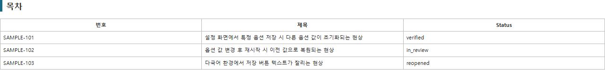

# AI 분석을 위한 ALM 이슈 PDF/HTML/Markdown Export 자동화

Polarion(ALM)의 검색 조건에 해당하는 Work Item을 REST API로 수집하고, 본문·댓글·연관
사양/이슈·첨부 이미지를 포함한 **최종 보관/공유용 PDF**, **웹에서 바로 보는 HTML**,
**GPT 등 LLM에 붙여넣기 좋은 경량 Markdown** 세 가지로 동시에 변환하는 자동화 스크립트입니다.

ALM 자체는 이슈를 잘 저장하지만, 그 데이터를 외부 도구나 AI가 바로 분석하기 좋은 형태로
내보내 주지는 않습니다. 이 스크립트는 그 사이에 있는 "데이터 전처리 계층" 역할을 합니다.

```
ALM 원본 데이터  →  Python 자동화 (검색·정리·이미지 복원)  →  PDF / HTML / Markdown  →  GPT 분석
```

> PDF는 예전에는 이슈마다 수동으로 인쇄해서 만들었지만, 지금은 Playwright 내장
> Chromium이 HTML을 그대로 인쇄해서 자동으로 만들어 줍니다. HTML/Markdown은 항상 함께
> 생성되므로, PDF 변환에 실패해도(예: Chromium 미설치) 다른 두 결과물은 그대로 남습니다.

## 빠른 시작

명령어를 쓰고 싶지 않다면 **탐색기에서 `실행하기.bat`을 더블클릭**하세요. 무엇이
빠졌는지 확인하고, 무엇을 내보낼지 물어본 다음, 끝나면 결과 문서까지 열어 줍니다.

직접 실행한다면 아래 세 단계면 됩니다.

```powershell
# 1. 필요한 패키지 설치 (최초 1회)
python -m pip install -r requirements.txt
python -m playwright install chromium

# 2. 설정 파일을 만들어 사내 서버 주소·프로젝트 ID를 채우고, PAT를 등록
copy config.example.yaml config.yaml
setx POLARION_TOKEN "발급받은 PAT"

# 3. 준비됐는지 확인하고 바로 실행 (새 PowerShell 창에서)
python polarion_query_backup.py --check
python polarion_query_backup.py -id VP-6955 --open
```

`--check`는 Polarion에 접속하기 전에 설정 파일·PAT·PDF 엔진·접속 권한을 한 번에
점검하고, 빠진 것이 있으면 그것을 해결하는 명령까지 알려 줍니다.

```
실행 환경 점검
----------------------------------------------------------
  [OK] 설정 파일: C:\...\config.yaml
  [OK] 서버 주소: https://alm.example.com
  [OK] 프로젝트 ID: VXvue
  [OK] 환경변수 POLARION_TOKEN: 설정됨 (565자)
  [OK] PDF 엔진(Chromium) 실행 확인
  [OK] Polarion 접속/권한 확인
----------------------------------------------------------
점검 결과: 준비 완료. 바로 실행할 수 있습니다.
```

## 스크린샷

> 아래 화면은 전부 가상의 샘플 데이터로 생성한 예시입니다 (`examples/sample_output`).
> 실제 실행 결과는 사내 Polarion 데이터를 그대로 반영합니다.

**요약 대시보드** — Status/Author/Type/Occurred Version별 건수를 한눈에 확인합니다.


**목차(TOC)** — 검색 결과가 많을 때 원하는 이슈로 바로 이동합니다.



**이슈 상세** — 발생원인/조치내역을 최상단에 배치하고, 본문 첨부 이미지를 HTML에 직접
임베드합니다.


## 왜 만들었나

ALM 안에서는 이슈를 잘 볼 수 있지만, 밖에서 활용하기는 어려웠습니다.

- 원하는 검색 결과 전체를 유연하게 내보내기 어려움
- 상세 본문, 댓글, 링크, 첨부 이미지가 일관되게 포함되지 않음
- 발생원인/조치내역이 다른 필드들 사이에 섞여 있어 핵심 파악이 느림
- ALM 내부 이미지 참조(`workitemimg:`)가 로컬 HTML에서 깨짐
- 연결된 항목이 사양인지 이슈인지 번호만으로는 구분이 안 됨
- 검색 결과가 수십 건이면 이슈마다 열기 → 복사 → 정리를 반복해야 함

이 자동화는 검색 Query 하나로 이 과정 전체를 대체하고, 결과를 바로 GPT 분석 자료로 쓸 수
있는 형태로 만드는 것을 목표로 합니다.

## 주요 기능

- **검색 Query 기반 일괄 Export**: 개별 이슈 ID가 아니라 Polarion 검색 Query(Convert to
  Text 결과)를 넣으면, 조건에 맞는 Work Item 전체를 한 번에 처리합니다.
- **이슈 ID만 알면 바로 실행**: `-id VP-6955` 또는 `-id VP-6955,VP-7001` 처럼 ID만 넣으면
  됩니다. Polarion 쿼리 문법(`id:VP\-6955`)과 백슬래시 이스케이프는 스크립트가 알아서
  처리합니다.
- **명령행에서 쿼리 바로 지정**: 매번 `config.yaml`을 열어 쿼리를 고치고 저장할 필요 없이
  `-query "id:VP\-6955"` 처럼 실행할 때 바로 넘길 수 있습니다. 설정 파일은 그대로 두고
  이번 실행에만 적용됩니다.
- **더블클릭 실행 도우미**: `실행하기.bat`(내부적으로 `run.ps1`)이 Python·패키지·설정
  파일·PAT를 차례로 확인하고, 빠진 것은 그 자리에서 만들어 주며, 무엇을 내보낼지 물어본
  뒤 결과까지 열어 줍니다. `run.ps1 -id VP-6955` 처럼 옵션을 그대로 넘겨도 됩니다.
- **실행 전 환경 점검(`--check`)**: 수십 건을 다 수집한 뒤에야 "Chromium이 없다"는 걸
  알게 되는 일이 없도록, 접속 전에 준비 상태를 먼저 확인합니다.
- **화면에서 보기 좋은 HTML**: 같은 문서가 인쇄(A4)와 화면 양쪽에 맞게 조판됩니다.
  화면에서는 상단에 검색창과 Status 필터가 고정되어 원하는 이슈만 추려 볼 수 있고,
  각 이슈에서 목차로 바로 돌아갈 수 있습니다. 이 UI는 인쇄물·PDF에는 남지 않습니다.
- **일시적인 네트워크 오류 자동 재시도**: 연결이 잠깐 끊기거나 서버가 429/5xx로 답하면
  대기 시간을 늘려 가며 다시 시도합니다. 설정을 고쳐야 하는 오류(401/403/404)는
  재시도하지 않고 바로 알려 줍니다.
- **진행 상황 표시**: 이슈별로 어디까지 진행됐는지, 어떤 첨부를 받고 있는지, 남은 시간이
  얼마나 되는지 보여 줍니다. 큰 첨부를 받는 동안 멈춘 것처럼 보이지 않습니다.
- **발생원인·조치내역 우선 배치**: `occurrenceCause`/`actionDetails` 등 분석에 중요한
  필드를 문서 최상단에 배치합니다.
- **연관 사양/이슈 자동 구분**: 연결된 Work Item을 다시 조회해 `type` 값 기준으로 사양(SRS)과
  이슈를 구분해서 표시합니다.
- **본문 첨부 이미지 복원**: `workitemimg:` 내부 참조를 첨부파일 API와 매칭해 Base64로
  HTML에 직접 삽입합니다. 재현 절차에 포함된 캡처 이미지도 그대로 보입니다.
- **실패 단위 분리**: 첨부파일 하나가 실패해도 해당 Work Item, 나아가 전체 Export가 중단되지
  않습니다. 실패 내역은 `manifest.json`에 별도로 남습니다.
- **요약 대시보드**: Status/Author/Type/Occurred Version별 건수를 문서 상단에 자동
  집계합니다.
- **목차(TOC) 내비게이션**: 결과가 많을 때 이슈 ID/제목/Status로 원하는 항목으로 바로 이동할
  수 있는 링크를 생성합니다.
- **AI 분석용 경량 Markdown 동시 생성**: HTML은 이미지를 Base64로 품고 있어 파일 용량이
  크고, 텍스트 그대로 GPT 대화창에 붙여넣기엔 토큰 낭비가 큽니다. 같은 내용을 담은 `.md`
  파일을 함께 생성해서, 텍스트 분석이 목적일 때 더 가볍게 사용할 수 있습니다.
- **이슈별 개별 HTML 분리 저장**: 전체 결과가 아니라 이슈 1건만 GPT에 첨부하고 싶을 때를
  위해, 각 `[이슈ID]/report.html`도 함께 생성합니다.
- **최종 PDF 자동 생성**: HTML을 Playwright 내장 Chromium으로 그대로 인쇄해 `.pdf`로
  저장합니다. 이슈마다 새 페이지로 나뉘고(A4), 이전에 수동으로 하던 "HTML 인쇄해서 PDF
  만들기" 작업이 사라집니다. PDF 생성이 실패해도 HTML/Markdown은 정상적으로 남습니다.

## 설치

```powershell
python -m pip install -r requirements.txt

# PDF 생성에 쓰는 Chromium 다운로드 (최초 1회)
python -m playwright install chromium
```

`실행하기.bat`으로 처음 실행하면 위 두 명령이 필요한지 확인하고, 필요하면 설치할지
물어보므로 직접 입력하지 않아도 됩니다.

## PAT(Personal Access Token) 설정

```powershell
# 현재 PowerShell 창에서만
$env:POLARION_TOKEN="발급받은 PAT"

# 영구 설정 (새 PowerShell 창부터 적용)
setx POLARION_TOKEN "발급받은 PAT"
```

## 설정

`config.example.yaml`을 복사해 `config.yaml`로 저장한 뒤 사내 환경에 맞게 값을 채우세요.
`config.yaml`은 사내 서버 주소·프로젝트 ID·검색 조건이 들어가므로 `.gitignore`에 포함되어
있고 저장소에는 올라가지 않습니다.

```powershell
copy config.example.yaml config.yaml
```

검색 조건은 Polarion Work Items 화면에서 만든 뒤, Query Pane의 `Convert to Text` 결과를
그대로 쓰세요. 표시명과 내부 사용자 ID가 다를 수 있으므로, 화면을 보고 직접 추측한 쿼리보다
이 방법이 안전합니다.

검색 조건은 세 곳 중 하나에서 옵니다.

| 방법 | 쓰는 곳 | 언제 |
| --- | --- | --- |
| 명령행 `-id` | 실행할 때 인자로 전달 | 특정 이슈 몇 건만 뽑을 때 (가장 흔한 경우) |
| 명령행 `-query` | 실행할 때 인자로 전달 | 상태·작성자·버전 등 조건으로 뽑을 때 |
| `config.yaml > search.query` | 설정 파일 | 항상 같은 조건으로 돌릴 때 (기본값 역할) |

우선순위는 **`-id` > `-query` > 설정 파일** 입니다. 명령행 값을 쓰더라도 설정 파일은
수정되지 않습니다. `sort`, `max_items` 같은 나머지 검색 옵션은 계속 `config.yaml`에서
관리합니다.

자주 건드리게 되는 설정값은 아래와 같습니다.

| 설정 | 기본값 | 설명 |
| --- | --- | --- |
| `output.document_title` | `ALM Issue Report` | 결과 문서 맨 위에 찍히는 제목 (`--title`로 덮어쓰기 가능) |
| `output.directory` | `polarion_backup` | 결과 폴더 (`-o`로 덮어쓰기 가능) |
| `output.generate_pdf` | `true` | PDF 생성 여부 |
| `polarion.max_retries` | `3` | 일시적 오류(429/5xx/연결 끊김) 재시도 횟수 |
| `polarion.retry_backoff_seconds` | `2` | 재시도 대기 시간(초). 시도마다 2배씩 증가 |

## 실행

### 가장 쉬운 방법 — `실행하기.bat`

탐색기에서 더블클릭하면 준비 상태를 확인한 뒤 무엇을 내보낼지 물어봅니다.

```
  무엇을 내보낼까요?

    1) 이슈 ID 입력       예) VP-6955  또는  VP-6955,VP-7001
    2) 검색 쿼리 입력     Polarion 화면의 Convert to Text 결과
    3) config.yaml 에 저장된 조건 그대로
    4) 실행 환경만 점검 (Polarion에 접속하지 않음)
```

같은 도우미를 PowerShell에서 옵션과 함께 쓸 수도 있습니다. 파이썬 스크립트와 옵션 이름이
같습니다.

```powershell
.\run.ps1 -id VP-6955
.\run.ps1 -id VP-6955,VP-7001 -Out 결과_모음
.\run.ps1 -query "status:(in_progress) AND author.id:(hong)"
.\run.ps1 -Check
```

`run.ps1`은 실행 직전에 실제로 돌리는 명령을 보여 주므로, 익숙해지면 그 명령을 그대로
쓰면 됩니다.

### 이슈 ID로 실행 (권장)

```powershell
python polarion_query_backup.py -id VP-6955
python polarion_query_backup.py -id VP-6955,VP-7001
```

- `-id`, `--id` 둘 다 같은 옵션입니다.
- 쉼표나 공백으로 여러 개를 넣을 수 있습니다.
- `VP-6955`의 `-`는 Polarion 쿼리에서 "제외"를 뜻하기 때문에 원래는 `id:VP\-6955`로 써야
  하지만, `-id`를 쓰면 스크립트가 알아서 바꿔 줍니다.

### 검색 쿼리로 실행

조건이 ID 목록으로 표현되지 않을 때 씁니다.

```powershell
python polarion_query_backup.py -query "status:(in_progress in_review) AND author.id:(hong)"
```

- `-query`, `-q`, `--query` 셋 다 같은 옵션입니다.
- 쿼리는 **반드시 큰따옴표로 감싸세요.** Polarion 쿼리에는 `\`, `:`, 공백이 들어가고,
  PowerShell은 큰따옴표 안의 `\`를 그대로 넘겨줍니다.
- 실행 첫 줄에 어떤 조건을 어디서 읽었는지 찍히므로 바로 확인할 수 있습니다.

```
Query: id:VP\-6955    (출처: 명령행 -id)
```

### 설정 파일의 쿼리로 실행

`-id`와 `-query`를 모두 생략하면 `config.yaml`의 `search.query`를 씁니다.

```powershell
python polarion_query_backup.py
```

`config.yaml`은 기본값이라 `--config`를 따로 붙일 필요가 없습니다. 다른 설정 파일을 쓸
때만 지정하세요.

```powershell
python polarion_query_backup.py -id VP-6955 --config config.other.yaml
```

### 전체 옵션

| 옵션 | 설명 |
| --- | --- |
| `-id VP-6955,VP-7001` | 이슈 ID로 지정 (쿼리 문법 자동 처리) |
| `-query "..."` | Polarion 검색 Query로 지정 |
| `--limit N` | 이번 실행에만 최대 건수 제한 |
| `-o 폴더명` | 결과를 저장할 폴더 |
| `--title "텍스트"` | 결과 문서 맨 위에 찍히는 제목 |
| `--timestamp` | 실행 시각 하위 폴더에 저장 (이전 결과 보존) |
| `--open` | 끝나면 결과 문서를 자동으로 열기 |
| `-y`, `--yes` | 기존 결과 폴더 삭제 확인 건너뛰기 |
| `--check` | 접속하지 않고 준비 상태만 점검 |
| `--config PATH` | 설정 파일 경로 (기본값 `config.yaml`) |
| `--help` | 도움말 |

### 이전 결과를 남기고 싶을 때

실행할 때마다 결과 폴더(`output.directory`, 기본 `polarion_backup/`)를 **지우고 새로
만듭니다.** 사람이 직접 실행한 경우에는 지우기 전에 한 번 물어봅니다.

```
[확인] 결과 폴더가 이미 있습니다: C:\...\polarion_backup
        안에 이슈 폴더 12개가 있고, 모두 삭제됩니다.
        이전 결과를 남기려면 -o 다른폴더 또는 --timestamp 를 사용하세요.
        삭제하고 계속할까요? [y/N]
```

쿼리를 바꿔 가며 여러 번 돌릴 때는 아래 둘 중 하나를 쓰세요.

```powershell
# 실행마다 다른 폴더에 저장
python polarion_query_backup.py -id VP-6955 -o 결과_6955

# 같은 폴더 아래 실행 시각으로 나눠 저장 (polarion_backup/20260915_143012/)
python polarion_query_backup.py -id VP-6955 --timestamp
```

예약 실행처럼 입력을 받을 수 없는 환경에서는 묻지 않고 기존처럼 그대로 진행합니다.
`-y`를 붙이면 사람이 실행할 때도 묻지 않습니다.

### 첫 시험 — 필드 매핑 확인

사내 커스텀 필드 ID를 확인하려면 1건만 먼저 받아 보세요. 설정 파일을 고칠 필요 없이
`--limit`로 이번 실행에만 제한할 수 있습니다.

```powershell
python polarion_query_backup.py --limit 1
```

생성된 `field_inventory.json`과 각 이슈의 `backup.json`에서 실제 커스텀 필드 ID를 확인한
후 `fields.display`의 key를 사내 환경에 맞게 조정하세요.

## 출력 구조

```
polarion_backup/
├─ polarion_query_backup.pdf    # 최종 보관/공유용 PDF (요약 대시보드 + 목차 + 이슈 전체)
├─ polarion_query_backup.html   # 사람이 보는 통합 문서 (PDF와 동일한 내용의 웹 버전)
├─ polarion_query_backup.md     # GPT 등에 붙여넣기 좋은 경량 Markdown
├─ field_inventory.json         # 조회된 필드 ID 목록
├─ manifest.json                # 처리 건수 / 실패 내역 / 실행 시각 / 소요 시간
└─ [이슈ID]/
   ├─ backup.json               # API 원본 데이터
   ├─ report.html               # 이 이슈 1건만 담은 개별 HTML
   └─ attachments/              # 첨부파일 (이미지 포함)
```

## HTML을 브라우저에서 볼 때

`polarion_query_backup.html`은 PDF와 같은 내용이지만, 화면에서는 읽기 좋은 폭과 크기로
조판되고 아래 기능이 추가로 동작합니다. **인쇄하거나 PDF로 만들 때는 모두 사라지므로
최종 문서에는 영향이 없습니다.**

- **상단 고정 검색창**: 이슈 ID·제목뿐 아니라 **본문 내용까지** 검색해서, 조건에 맞는
  이슈만 남기고 나머지는 숨깁니다. 옆의 `Status` 필터와 함께 쓸 수 있습니다.
- **건수 표시**: 필터를 걸면 `3 / 27건` 처럼 몇 건이 남았는지 보여 줍니다.
- **목차로 돌아가기**: 각 이슈 오른쪽 위의 `↑ 목차` 를 누르면 목차로 바로 올라갑니다.
- **목차 링크**: 이슈 ID와 제목 어느 쪽을 눌러도 해당 이슈로 이동합니다.

## GPT 등 AI 분석에 활용할 때

- **PDF/HTML**을 첨부하면 이미지까지 포함해서 사람이 검토하듯 볼 수 있습니다. 재현 절차에
  캡처 이미지가 있는 이슈는 PDF나 HTML(또는 이슈 폴더 전체)을 첨부하세요. 보관·공유용
  최종 문서로는 PDF를 쓰고, 웹 브라우저에서 바로 열어보거나 링크로 공유할 때는 HTML을
  쓰면 됩니다. 내용은 동일합니다.
- **Markdown**은 텍스트 위주 분석(발생원인 분류, 공통 원인 요약, 리포트 초안 작성 등)에
  더 적합합니다. 다만 Markdown 안의 이미지 링크는 로컬 파일 상대경로이기 때문에, GPT
  대화창에 **텍스트만 붙여넣으면 이미지가 보이지 않습니다.** 이미지까지 함께 봐야 하는
  분석이라면 Markdown 대신 HTML을 첨부하거나, 이슈 폴더(HTML + attachments)를 통째로
  첨부하세요.

```
첨부한 HTML은 [버전]에서 발생한 미완료 이슈 자료입니다.
다음 기준으로 분석해줘.
1. 발생원인별 이슈 분류
2. 반복적으로 나타나는 원인
3. 사양 보완이 필요한 이슈
4. 테스트케이스 보강이 필요한 영역
5. 우선 확인해야 할 이슈
```

## 예시 결과물

`examples/sample_output/`에 가상의 샘플 데이터로 생성한 결과물이 들어 있습니다. 실제
Polarion 접속 없이 출력 형식을 먼저 확인하고 싶을 때 열어보세요.

> 이 예시 파일과 위쪽 스크린샷은 화면용 조판·검색 UI가 추가되기 전에 생성한 것이라
> 지금 실행한 결과와 모양이 조금 다릅니다. 담긴 정보와 구조는 같습니다.

## 문제 해결

무엇이 문제인지 모를 때는 먼저 점검부터 돌려 보세요. 대부분 여기서 원인과 해결 명령을
같이 알려 줍니다.

```powershell
python polarion_query_backup.py --check
```

| 증상 | 원인과 해결 |
| --- | --- |
| `설정 파일을 찾을 수 없습니다` | `copy config.example.yaml config.yaml` 후 서버 주소·프로젝트 ID를 채우세요. |
| `환경변수 POLARION_TOKEN가 없습니다` | `setx POLARION_TOKEN "발급받은 PAT"` 실행 후 **새 PowerShell 창**에서 다시 시도하세요. `setx`는 이미 열린 창에는 적용되지 않습니다. |
| `401 Unauthorized` | PAT가 만료됐거나 잘못 복사됐습니다. Polarion에서 다시 발급해 등록하세요. |
| `403 Forbidden` | 해당 프로젝트 조회 권한이 없습니다. 관리자에게 문의하세요. |
| `404 Not Found` | `polarion.host` 주소나 `project_id`가 틀렸습니다. Polarion 웹 주소와 비교해 보세요. |
| `서버에 연결하지 못했습니다` | 사내망/VPN 연결을 확인하세요. 일시적 오류는 이미 3회까지 자동 재시도한 뒤 나오는 메시지입니다. |
| `검색 결과가 0건입니다` | 쿼리 조건이 맞지 않습니다. Polarion 검색 화면에서 조건을 만든 뒤 Query Pane > `Convert to Text` 결과를 그대로 쓰세요. 이때 기존 결과 폴더는 지워지지 않습니다. |
| `PDF 생성 실패` / `Chromium 미설치` | `python -m playwright install chromium` 을 실행하세요. PDF가 필요 없으면 `config.yaml`의 `output.generate_pdf`를 `false`로 두면 됩니다. HTML·Markdown은 이미 정상 생성되어 있습니다. |
| 특정 이슈만 `처리 실패`로 표시됨 | 해당 이슈만 건너뛰고 나머지는 정상 처리됩니다. 원인은 `manifest.json`의 `failures`에 남습니다. |
| `run.ps1`을 실행할 수 없다는 보안 오류 | `실행하기.bat`으로 실행하세요. 정책을 우회하지 않고 이 실행에만 허용해서 띄웁니다. |
| 결과 폴더를 실수로 지울까 걱정될 때 | `--timestamp`(실행 시각별 폴더) 또는 `-o 다른폴더`를 쓰세요. |

## 핵심 설계 원칙

- 검색 조건은 코드 밖(명령행 인자 또는 설정 파일)에서 관리한다 (특정 이슈 ID에 종속되지 않음)
- 자주 바뀌는 값(쿼리)은 명령행에서, 잘 안 바뀌는 값(서버/필드/출력)은 설정 파일에서 다룬다
- 도구 문법(쿼리 이스케이프 등)을 사람이 외우게 하지 않는다 — 사람은 아는 값(이슈 ID)을 넣는다
- 실패는 늦게 말고 일찍 알린다 (수집을 끝낸 뒤가 아니라 접속 전에 점검한다)
- 되돌릴 수 없는 삭제는 사람에게 묻되, 무인 실행은 막지 않는다
- 같은 문서가 인쇄물과 화면 양쪽에서 읽히게 하되, 화면 전용 UI가 인쇄물을 오염시키지 않는다
- 개별 첨부파일 실패가 전체 Export를 중단시키지 않는다
- AI 분석에 불필요한 필드는 출력 단계에서 제외한다
- 원본 JSON과 사람이 읽는 HTML/Markdown을 함께 보관한다
- ALM 고유 이미지 참조를 독립적인 이미지로 변환한다
- 연결 항목의 Type을 다시 조회해 사양과 이슈를 구분한다

## 버전 히스토리

- **v4**: 동영상 첨부 미다운로드 처리, 첨부파일 실패 격리, Edge PDF 한글 경로 우회
- **v5**: 연결 Work Item 상세 조회로 사양/이슈 구분, 본문 이미지 Base64 임베드
- **v6**: (당시) PDF 생성 기능 제거, AI 분석용 경량 Markdown 동시 출력, 요약 대시보드,
  목차(TOC) 내비게이션, 이슈별 개별 HTML 분리 저장, Author/Assignee/Reviewer relationship
  필드 정상 표시
- **v7**: PDF 최종 출력을 Playwright 기반으로 재도입. 기존 Edge 헤드리스 CLI
  방식은 한글 경로·비정상 종료 코드 문제로 신뢰성이 낮아 제거했었는데, Playwright 내장
  Chromium의 `page.pdf()`로 다시 구현해 훨씬 안정적으로 동작합니다. PDF 생성이 실패해도
  HTML/Markdown 출력에는 영향이 없습니다.
- **v9 (현재)**: 사용 편의성 개선. 이슈 ID만 넣으면 되는 `-id` 옵션(쿼리 이스케이프 자동
  처리), 더블클릭 실행 도우미(`실행하기.bat` / `run.ps1`), 접속 전 환경 점검 `--check`,
  결과 폴더 삭제 전 확인과 `-o`·`--timestamp`, 진행 상황·남은 시간 표시, 일시적 오류
  자동 재시도, 화면용 HTML 조판과 검색·Status 필터·목차 복귀 링크(인쇄물에는 영향 없음),
  결과 문서 제목을 `ALM Issue Report`로 바꾸고 `output.document_title`/`--title`로 변경
  가능하게 함. 기존 명령(`-query`, `--config`, 설정 파일 전체)은 그대로 동작합니다.
- **v8**: 검색 쿼리를 명령행에서 바로 지정하는 `-query` 옵션 추가
  (`python polarion_query_backup.py -query "id:VP\-6955"`). 쿼리를 바꿀 때마다
  `config.yaml`을 열어 수정·저장하던 과정이 사라졌습니다. `--config`는 `config.yaml`을
  기본값으로 쓰므로 평소에는 생략할 수 있고, 설정 파일 누락·쿼리 누락은 Polarion에
  접속하기 전에 먼저 걸러서 알려 줍니다.
