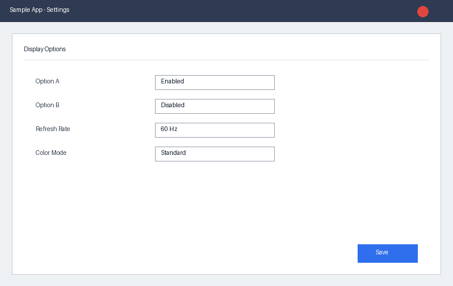

# Polarion Work Item Backup

- **Project**: SampleProject
- **Count**: 3
- **Query**: `NOT status:closed AND author.id:(sample_user01 sample_user02) AND occurredVersion.KEY:SampleApp_1_0_0_001`

## Status별 건수

- verified: 1
- in_review: 1
- reopened: 1

## Author별 건수

- sample_user01: 2
- sample_user02: 1

## Type별 건수

- issue: 3

## Occurred Version별 건수

- SampleApp 1.0.0.001: 3

---

## SAMPLE-101 — 설정 화면에서 특정 옵션 저장 시 다른 옵션 값이 초기화되는 현상

### 발생원인 및 조치내역

**발생원인(Root Cause)**

설정 저장 로직에서 필드를 순서대로 기록하는 과정 중 이전 값을 덮어쓰는 순서 오류가 있었음.

**조치내역(수정사항) Resolution**

설정 저장 순서를 항목별 독립 기록 방식으로 변경하여 서로 덮어쓰지 않도록 수정함.

### Project 및 Version 정보

- **Project**: SampleProject
- **Release Vision**: SampleApp 1.0.0
- **Occurred in Version**: SampleApp 1.0.0.001
- **Target Version**: SampleApp 1.0.0.002

### 전체 필드

- **Type**: issue
- **Author**: sample_user01
- **Assignee(s)**: sample_user02
- **Reviewer**: sample_user03
- **Status**: verified
- **QA Review Result**: lab_fixed
- **Frequency**: always
- **재현 방법(Reproduction Step)**: [사전조건]
설정 화면 진입

[재현절차]
1. Option A를 변경한다.
2. Option B를 변경한다.
3. 저장 버튼을 클릭한다.

[기대결과]
두 옵션이 모두 저장되어야 한다.

### Comments

**#1 sample_user02 2026-01-10T09:00:00Z**

샘플 댓글입니다. 재현 조건 확인 완료.

**#2 sample_user01 2026-01-12T02:30:00Z**

수정 사항 반영 후 재검증 완료했습니다.

### Linked Work Items

**연관된 사양**

- [srs] SAMPLE-050 — 설정 저장 동작 사양 (relates_to)

### Attachments

---

## SAMPLE-102 — 옵션 값 변경 후 재시작 시 이전 값으로 복원되는 현상

### 발생원인 및 조치내역

**발생원인(Root Cause)**

설정 파일 저장 시점과 앱 종료 시점 사이의 경쟁 조건으로 최신 값이 기록되지 않음.

**조치내역(수정사항) Resolution**

설정 저장을 종료 이벤트가 아닌 값 변경 즉시 동기 저장하도록 수정함.

### Project 및 Version 정보

- **Project**: SampleProject
- **Release Vision**: SampleApp 1.0.0
- **Occurred in Version**: SampleApp 1.0.0.001
- **Target Version**: SampleApp 1.0.0.002

### 전체 필드

- **Type**: issue
- **Author**: sample_user01
- **Assignee(s)**: sample_user03
- **Reviewer**: sample_user02
- **Status**: in_review
- **QA Review Result**: in_progress
- **Frequency**: sometimes
- **재현 방법(Reproduction Step)**: [사전조건]
앱 실행 중

[재현절차]
1. Color Mode를 변경한다.
2. 앱을 종료 후 재실행한다.

[기대결과]
변경한 값이 유지되어야 한다.

### Comments

**#1 sample_user02 2026-01-10T09:00:00Z**

샘플 댓글입니다. 재현 조건 확인 완료.

**#2 sample_user01 2026-01-12T02:30:00Z**

수정 사항 반영 후 재검증 완료했습니다.

### Linked Work Items

**연관된 사양**

- [srs] SAMPLE-050 — 설정 저장 동작 사양 (relates_to)

### Attachments

---

## SAMPLE-103 — 다국어 환경에서 저장 버튼 텍스트가 잘리는 현상

### 발생원인 및 조치내역

**발생원인(Root Cause)**

버튼 컨테이너 너비가 영어 기준으로 고정되어 있어 긴 번역 문자열이 잘림.

**조치내역(수정사항) Resolution**

버튼 너비를 텍스트 길이에 따라 가변적으로 조정하도록 수정함.

### Project 및 Version 정보

- **Project**: SampleProject
- **Release Vision**: SampleApp 1.0.0
- **Occurred in Version**: SampleApp 1.0.0.001
- **Target Version**: SampleApp 1.0.0.002

### 전체 필드

- **Type**: issue
- **Author**: sample_user02
- **Assignee(s)**: sample_user01
- **Reviewer**: sample_user03
- **Status**: reopened
- **QA Review Result**: lab_fixed
- **Frequency**: always
- **재현 방법(Reproduction Step)**: [사전조건]
언어 설정을 특정 언어로 변경

[재현절차]
1. 설정 화면 진입
2. 저장 버튼 텍스트 확인

[기대결과]
텍스트가 잘리지 않아야 한다.

### Comments

**#1 sample_user02 2026-01-10T09:00:00Z**

샘플 댓글입니다. 재현 조건 확인 완료.

**#2 sample_user01 2026-01-12T02:30:00Z**

수정 사항 반영 후 재검증 완료했습니다.

### Linked Work Items

**연관된 사양**

- [srs] SAMPLE-050 — 설정 저장 동작 사양 (relates_to)

### Attachments

